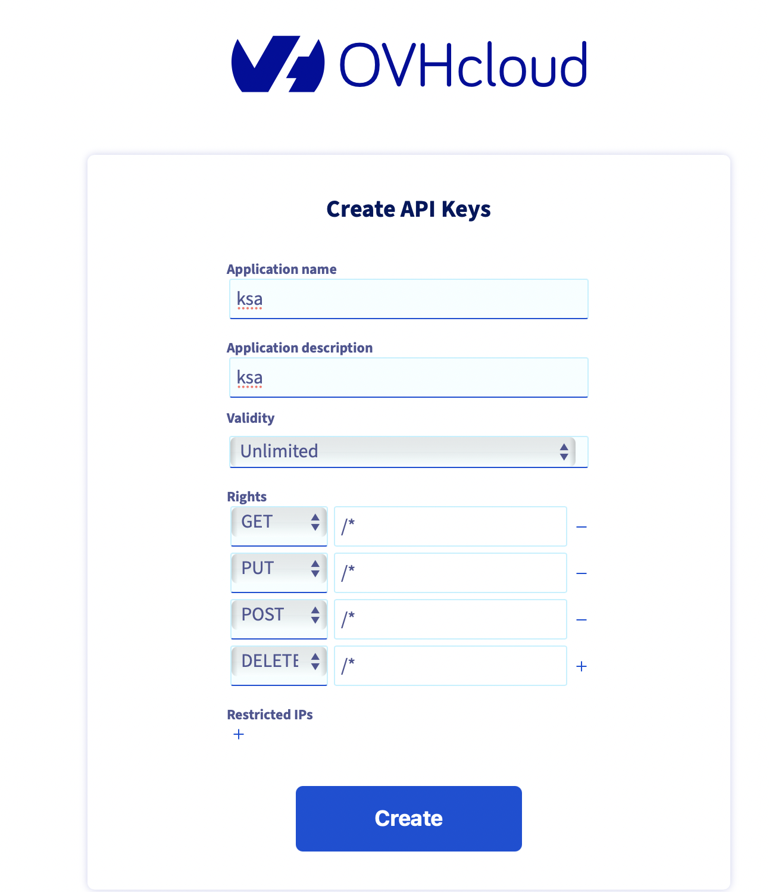
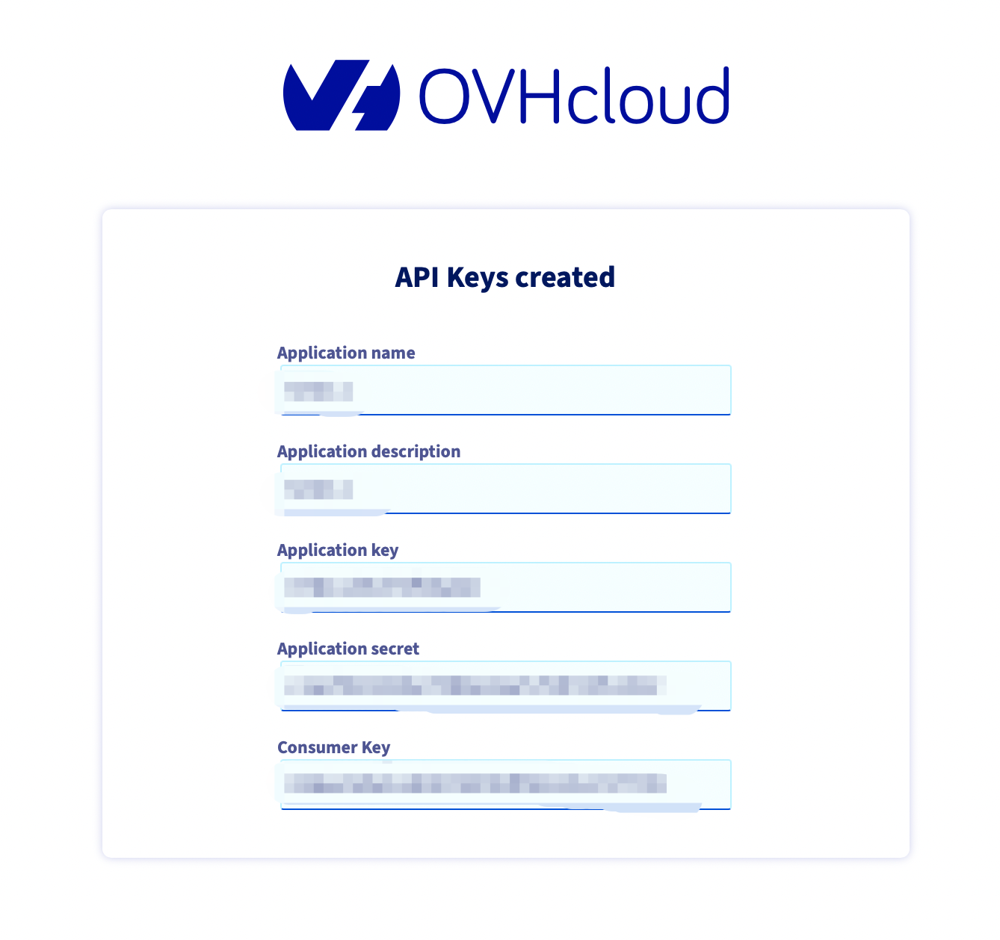

# OVH Server Monitor & Auto Purchase

An automation tool for monitoring and automatically purchasing OVH KSA servers. This tool continuously monitors the availability of KSA servers and automatically completes the purchase process when servers become available, with Telegram notifications.

## Features

- Automatic OVH KSA server availability monitoring
- Automatic order placement when servers become available
- Telegram bot notifications
- Multi-distribution Linux support (Debian/Ubuntu/CentOS/Fedora/OpenSUSE/Arch)
- Automatic dependency installation
- Error retry mechanism with detailed logging
- Secure credential handling
- Shopping cart automation with configurable options

## Prerequisites

- Linux system (root privileges required)
- Python 3
- OVH API credentials
- Telegram Bot Token and Chat ID
- Stable internet connection

## Installation & Usage

Choose one of these three methods to run the script:

### Method 1: Direct Execution (Recommended)


```bash
bash -c "$(curl -sSL https://raw.githubusercontent.com/wanghui5801/ovh_shell/main/ovh_shell.sh)"
```

### Method 2: Using sudo


```bash
sudo bash -c "$(curl -sSL https://raw.githubusercontent.com/wanghui5801/ovh_shell/main/ovh_shell.sh)"
```

### Method 3: Download and run
```bash
curl -sSL https://raw.githubusercontent.com/wanghui5801/ovh_shell/main/ovh_shell.sh -o ovh_shell.sh
chmod +x ovh_shell.sh
sudo ./ovh_shell.sh
```

## Background Execution

There are several methods to run the script in the background:

### Using Screen (Recommended)

Screen allows you to create a persistent terminal session that continues running even after you disconnect.

```bash
# Install screen
sudo apt-get install screen  # For Debian/Ubuntu
sudo yum install screen      # For CentOS/RHEL

# Create a new screen session
screen -S ovh_monitor

# Run the script
bash -c "$(curl -sSL https://raw.githubusercontent.com/wanghui5801/ovh_shell/main/ovh_shell.sh)"

# Detach from screen session: Press Ctrl+A, then D
# Reattach to screen session:
screen -r ovh_monitor
```

## Configuration

When running the script, you need to provide the following information:

1. Telegram configuration:
   - BOT_TOKEN: Telegram bot token
   - CHAT_ID: Chat ID to receive notifications

2. OVH API credentials:
   - OVH_ENDPOINT: API endpoint (default: ovh-eu)
   - OVH_APPLICATION_KEY: Application key
   - OVH_APPLICATION_SECRET: Application secret
   - OVH_CONSUMER_KEY: Consumer key

## OVH API Credentials Creation

First, you need an OVH account, then create an application in the corresponding region's API system to obtain OVH_APPLICATION_KEY, OVH_APPLICATION_SECRET, and OVH_CONSUMER_KEY.

If you are in the CA region, please create your application through [OVH API CA](https://ca.ovh.com/auth/api/createToken).

If you are in the IE region, please create your application through [OVH API IE](https://eu.ovh.com/auth/api/createToken).

### Permission Settings

To ensure the script can access the API properly, it is recommended to grant all permissions. The specific settings are as follows:



The final result should look like this:



This will provide you with the required OVH_APPLICATION_KEY, OVH_APPLICATION_SECRET, and OVH_CONSUMER_KEY.

## Telegram Bot Token & Chat ID

Chat with the official [@BotFather](https://t.me/BotFather) to create a Telegram bot. In the conversation, enter commands like `/start`, `/newbot`, and follow the prompts. You'll receive a new bot and a token in the following format:

```
987654321:ABCDEF_xdfguweSAExofxT9-wdl4x
```

**Next, send any message to your newly created bot.**

Then open [`https://api.telegram.org/bot<token>/getUpdates`](https://api.telegram.org/bot<token>/getUpdates) to get your chat ID.

Replace `<token>` with the token you received when creating the bot. Now you have both the BOT_TOKEN and CHAT_ID parameters needed for the script.

## Workflow

1. Check and install necessary dependencies
2. Install Python packages (ovh, requests)
3. Collect user configuration information
4. Download and run the monitoring script
5. Continuously monitor server availability
6. Automatically place orders and notify via Telegram when servers become available

## Error Handling

- Script includes automatic retry mechanism
- Automatic retry on network errors
- Notify errors via Telegram
- Detailed error logging

## Notes

- Requires root privileges to run
- Ensure stable network connection
- Keep API credentials secure
- Test Telegram notifications first

## License

This project is licensed under the MIT License - see the [LICENSE](LICENSE) file for details.

## Contribution

Welcome to submit Issues and Pull Requests!

MIT License

Copyright (c) 2024 wanghui5801

Permission is hereby granted, free of charge, to any person obtaining a copy
of this software and associated documentation files (the "Software"), to deal
in the Software without restriction, including without limitation the rights
to use, copy, modify, merge, publish, distribute, sublicense, and/or sell
copies of the Software, and to permit persons to whom the Software is
furnished to do so, subject to the following conditions:

The above copyright notice and this permission notice shall be included in all
copies or substantial portions of the Software.

THE SOFTWARE IS PROVIDED "AS IS", WITHOUT WARRANTY OF ANY KIND, EXPRESS OR
IMPLIED, INCLUDING BUT NOT LIMITED TO THE WARRANTIES OF MERCHANTABILITY,
FITNESS FOR A PARTICULAR PURPOSE AND NONINFRINGEMENT. IN NO EVENT SHALL THE
AUTHORS OR COPYRIGHT HOLDERS BE LIABLE FOR ANY CLAIM, DAMAGES OR OTHER
LIABILITY, WHETHER IN AN ACTION OF CONTRACT, TORT OR OTHERWISE, ARISING FROM,
OUT OF OR IN CONNECTION WITH THE SOFTWARE OR THE USE OR OTHER DEALINGS IN THE
SOFTWARE.
